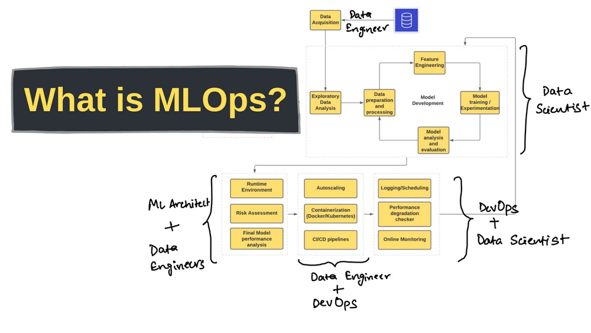
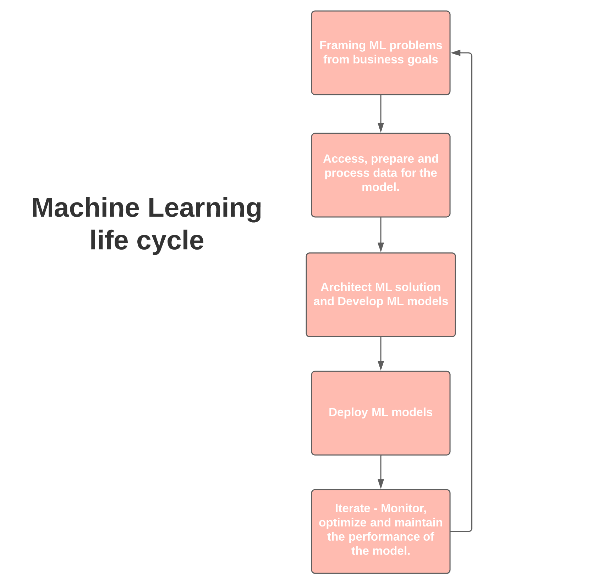

### What is MLOps? Machine Learning Operations

MLOps is like DevOps for Machine Learning

MLOps aims to unify ML systems development and ML systems deployment in order to standardize and streamline the continous delivery of high performing models in production.

The lifecycle involves several different teams of a data-driven organization.

From start to bottom we have like this:

1. Business development or Product team - defining business objective with KPIs

2. Data Engineering - data acquisition and preparation

3. Data Science - architecting ML solutions and developing models

4. IT or DevOps - complete deployment setup, monitoring alongside scientists

What skills are needed for MLOps?
---

Key skills to focus on:

1. Framing ML problems from business objectives

ML systems development starts with a business goal or objective. It can be a system to detect skin cancer in images labeled by dermatologists.

2. Architect ML and data solutions for the problem

After the ojectives are clearly translated into ML problems, the next step is to start searching for appropiate input data and the kinds of models to try for that kind of data.

Seaching for data is a process with several parts:

2.1. look for any available relevant dataset

2.2. check the credibility of the data and its source

2.3. is the data source compliant with regulations like GDPR?

2.4. How to make the dataset accessible?

2.5. What is the type of source? Static (files) or real time streaming (sensors)?

2.6. How many sources are to be used?

2.7. What cloud services will you use?

2.8. How to build a data pipeline that can drive both training and optimization once the model is deployed in prod environment?

3. Data preparation and processing - part of data engineering

Data preparation includes tasks like feature engineering, cleaning and then selecting the set of features that contribute to the output of the underlying problem.

4. Model training and experimentation - data science

5. Building and automating ML pipelines

6. Deploying models to the prod system

7. Monitor, optimize and maintain models

